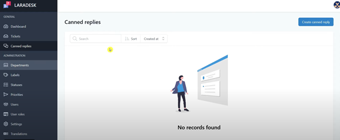

# Guía de uso: HelpDeskZ #

  
HelpDeskZ es un sistema gratuito basado en php que permite al usuario administrar el sitio web mediante un sistema de tickets.
Para ser exactos te permite:

- Crear y administrar tickets sobre errores, o problemas que pueda acarrear tu página web, desde saturación hasta problemas de seguridad.
- Agregar archivos a los tickets.
- Recibir emails de notificación en respuesta a cada ticket enviado.
- Organizar ticket por estado. Es decir, solucionado, arreglado o advertencia.
- Organizar ticket por etiqueta.
- Organizar ticket por departamento.
- Asignar gente o usuarios específicos a distintos departamentos.
- Asignar prioridad a un ticket específico.
- Administrar respuestas a dichos tickets y agregar esas respuestas a los tickets.
- Administrar usuarios y roles.
- Administrar las opciones o configuraciones desde la interfaz gráfica.

**Requerimientos:**
- Tener una versión de php 7.3 o superior.
- MySQL 5.7 o superior.
- BCMath PHP una extensión de la misma.
- CType que es otra extensión de php.
- Fileinfo PHP extension
- JSON PHP Extension
- Mbstring PHP Extension
- OpenSSL PHP Extension
- PDO PHP Extension
- Tokenizer PHP Extension
- XML PHP Extension

**Instalación:**
- 1.Conéctese con FTP a la carpeta pública de su servidor donde se encuentra el resto de su sitio Web
- 2.Cree una nueva carpeta donde instalará HelpDeskZ. Nómbrelo como desee, por ejemplo, "servicio de asistencia" o "soporte".
- 3.Asignar una URL correspondiente: http://www.site.com/support
- 4.Cargue todos los archivos de HelpDeskZ en su servidor.
- 5.Edite el archivo /hdz/app/Config/Helpdesk.new.php y complete la información requerida (URL del sitio, información de la base de datos), cambie el nombre de este archivo a Helpdesk.php
Abra /instale en su navegador, por ejemplo (modifique su URL):
http://www.site.com/support/install
- 6.Se ejecutará el script de instalación de HelpDeskZ. Haga clic en INSTALAR HELPDESKZ y siga las instrucciones a través del Acuerdo de licencia, Verifique la instalación y la configuración.
Antes de cerrar el script de instalación, ELIMINE la carpeta "/hdz/install" del servidor
Abra el panel de personal en su navegador, por ejemplo:
http://www.site.com/support/staff
- 7.Utilice los detalles de inicio de sesión que ingresó en el proceso de instalación.
Vaya a Configuración -> General para acceder a la página de configuración.
Desde aquí, podremos configurar desde la app “laravel panel” o “CPanel” los tickets que nos mandará a dicho dominio, es decir, mediante la base de datos que recoge los tickets, el dominio nos avisará mediante correo electrónico o notificación desde la web de los errores que hay en la página web.

Es un sistema muy flexible puesto que permite todo tipo de uso tanto desde la interfaz gráfica como desde la propia terminal o cmd. 
En el móvil, podremos instalar un “file manager”

Para poder enviar las incidencias.
Podremos acceder también desde la web que habremos asignado en la instalación.

 
Podremos crear una respuesta al ticket enviado directamente.

Podremos crear un departamento para enviar dichos tickets o subdividir nuestro dominio.

O directamente el ticket con una etiqueta de nombre.

Y el estado de dichos tickets.

 
Incluso la prioridad de dichos tickets.

Crear usuarios o grupos, incluso roles de usuarios.

En mi caso al crear la cuenta agregué al usuario admin.

Al crear a otro usuario nos permitirá elegir el tipo de permisos que tendrá incluso.
Eso sí, primero debemos acceder a la base de datos, crear al usuario, y asignarle los roles.

Podremos crear un departamento.

 
Y definirlo como visible entre los usuarios e incluso si permitir el departamento para todos los usuarios.

Y crear un usuario.

Junto su email y contraseña.
Crearemos un ticket por ejemplo.
 

El motivo es estándar del historial de motivos.
Y veremos si en el “dashboard” nos sale como aceptada.

Como vemos, nos sale como un ticket abierto o incidencia abierta.

**Licencia**

Es licencia de código abierto por lo que lo puede usar todo el mundo, pero tiene un pequeño inconveniente, que es que a la hora de usar algún tipo de panel, por ejemplo, CPanel, se nos puede llegar a cobrar por el uso de dicho sistema.

**Idiomas**

Los idiomas son flexibles, actualmente no están todos, pero en abril de 2021, se pudo añadir al plantel el brasileño y el francés.

En “crear idioma” podremos acceder a la base de datos y mediante ella, cambiar dicho idioma.

Y no tiene muchas más funcionalidades, es un programa muy muy flexible y sencillo, tiene una interfaz muy intuitiva y reutilizable.

